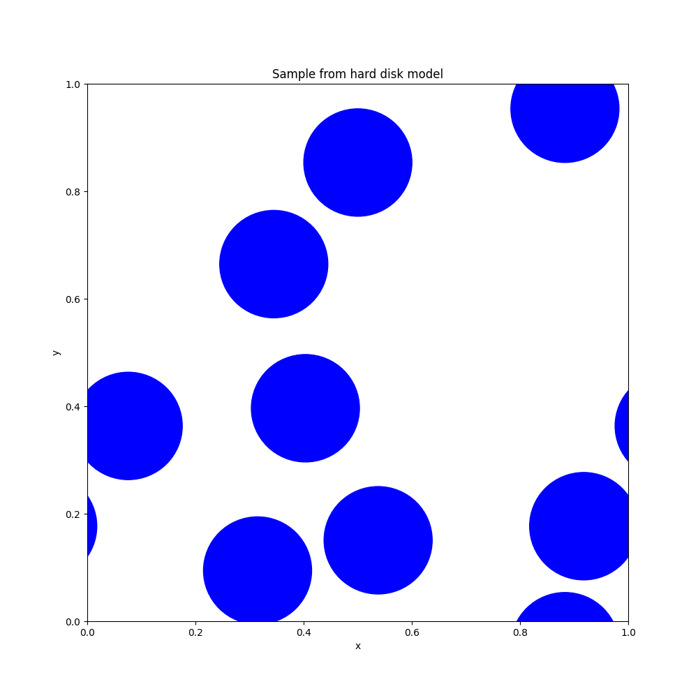

# Hard spheres

This repository contains an implementation of a perfect sampling algorithm for the 2D hard sphere model, based on a variant of the Randomness Recycler (https://arxiv.org/abs/math/0009242).

The algorithm takes in a graph and activity and outputs a random independent set from the hard core model on this graph at this activity.

For disks of radius 0.1 on the unit torus, it can handle activity up to around 35 easily, but drastically slows down beyond that.

The implementation has been tested by using it to estimate the expected size of the random independent set on various 4-vertex graphs and comparing it to the true value.



## Example usage

Make sure you have Python 3 and Matplotlib installed.

```
make
./hard-disk-perfect-sampler 35 0.1 |python3 plot.py 0.1
```

This generates a sample from the hard disk model with disks of radius 0.1 at activity 35, and plots it.

## Technical details

The Randomness Recycler for independent sets as described in the aforementioned paper requires the graph to be finite, as it stores a subset of the vertices. However, we can make some choices in the algorithm that ensures this subset is well-structured and can be stored in a compressed form.

We first describe a trick that allows us to avoid sweeping over the vertices in the given graph in some order. We replace the original graph with a ``blow-up'' which has vertex set Vx[0,lambda] and where a pair of vertices (v,a) and (w,b) are considered adjacent if v and w are adjacent or equal in the original graph. Now, we can instead sweep in increasing order of the second coordinate. Independent sets in this modified graph are closely related to independent sets in the original graph. We can sample from the hard core model on this graph instead and then simply drop the second coordinate from all vertices. Another way to think about it is instead of adding vertices to a (initially empty) subset, we gradually increase a (initially zero) activity.

In the ``recycle'' step, we will need to remove some vertices. We can do so in a way that keeps the set of kept vertices downward closed in the second coordinate. Furthermore, we can ensure that it always has the form of (Vx[0,a])\setminus \bigcup_{i=1}^k(N[v_i]x[l_i,a]), which can be represented using a finite number of reals.

A close inspection of the algorithm shows that it only uses the graph via a set of oracles that return: the total measure of the graph, a random vertex of the graph, the measure of the neighborhood of a given vertex, a random neighbor of a given vertex, and whether two given vertices are adjacent. This allows the graph to be infinite, which is the case for the hard disk model. For the hard disk model, the vertex set is the torus [0,1]x[0,1], and two vertices are considered adjacent if their distance is less than twice the radius of the disks.

I believe the analysis that the algorithm takes a linear number of steps when \lambda<1/(2\Delta) can be adapted, with \Delta replaced by the largest measure of the neighborhood of a point. However, each step is not longer constant time due to the complex representation of the subset of vertices.
